<div align="center"></div>


# 🔥 Enterprise Grade SOPs to Squash Routine IT Fires Like a Pro 

> 👉 **Detailed step-by-step procedures** for the 3 most common IT incidents (*MFA failures*, *VPN issues*, *Printer outages*) complete with personas + impact analysis + escalation paths
>
> Built from my actual enterprise IT experience, packaged into this super guide. I preloaded this guide with preventive policies, automation scripts, slack/email comms templates + sample reports
> <br>
> <br>
> [](https://azure.microsoft.com) [](https://www.azure.microsoft.com) [](https://www.powershell.com)


---

## 📌 Quick Summary

This repo hands you **three rock solid SOPs** that you can instantly start using to handle the most common IT fires that you'll see nearly EVERYDAY:

- **1) MFA not working** (the classic "I can't log in!")
- **2) VPN fails** (remote work panic mode)
- **3) Printer not working** (old school chaos, but will always be relevant)

Look, this project isn’t meant to just be a checklist. I wanted to make a full blown **battle tested game plan** for each of these common problems to:

- Identify exactly **who** is affected (and how expensive it gets when things break)
- Tell you exactly **what to do** (step by step, 0 guesswork)
- Clarify exactly **who to call** when things escalate
- Give you real scripts and comms templates to literally copy and paste in your environment
- Make you look like an absolute pro (because you'll actually fix things fast)

By the end, you’ll have everything you need to adapt this to your own team, your own environment, so you spend less time fire fighting, and more time looking awesome to your boss (and their boss, too)

In the future I'd love to see more contributing to this repo and adding to the list of incidents

> **Reminder**: *PharmaTech Labs scenarios are fictional. All data, scenarios, and configurations are mock examples and do not reflect Sanofi’s systems or practices. Any resemblance to actual organizations is coincidental.*

--- 

## 🧠 Visual Architecture

Below is the high level **Incident Response Workflow** we follow at PharmaTech Labs — starting from initial alert allll the way to full resolution and long term fix (or "patch"). Remember, this is designed to be flexible for any environment, so take it and adapt it

```mermaid
graph TD
    A[📨 Incident Reported] --> B{🧾 Triage by Helpdesk}
    B --> |Apply SOP| C[⚙️ Execute SOP Steps]
    C --> |Issue Resolved?| D{✅ Yes}
    C --> |No| E[📣 Escalate to L2/L3]
    E --> |Network/Security/Facilities/Vendor| F[🔧 Resolve]
    D --> G[📝 Document Resolution]
    F --> G
    G --> H[🧑‍💼 Manager Review]
    H --> I[📋 Post-Incident Report]
    I --> J[🔁 Update Preventive Systems]
```

<details>
<summary>🗺️ <strong>Incident Response Workflow</strong> (click to expand)</summary>



</details>

## 🛠️ Instructions to Test/Play with the Content (quick start/guide)
- **Review SOPs**: Explore the detailed SOP documents for each incident to learn how to handle real-world chaos with calm zen clarity
- **Run Scripts**: Customize and execute automation scripts by replacing placeholders -> (ex:`[YOUR_MFA_PORTAL]`, `[YOUR_VPN_SERVER_IP]`, `[YOUR_PRINTER_IP]`) swap these with your environment values
- **Log Mock Incidents**: Test your incident muscle memory by using the included github or jira issue templates I provide
- **Adapt Tickets**: Use this repo as your base... tweak the materials to match your org’s tech stack, team structure, and SLAs
- **Customize for Your Organization**: Follow the [Adapting For Your Environment](#adapting-for-your-environment) section for more comprehensive guide

## 🧭 Troubleshooting Outlines (aka: if X happens, do Y)
Super quick visual decision trees, these are great for building quick intuition so you can spot patterns fast and move like a pro
<details>
<summary>View MFA SOP Flow</summary>


</details>

<details>
<summary>View VPN SOP Flow</summary>


</details>

<details>
<summary>View Printer SOP Flow</summary>


</details>

## Table of Contents
1.  [User Personas Overview](#user-personas-overview)
2.  [🛡️ Incident #1 - MFA Not Working](#mfa-not-working)
3.  [🌐 Incident #2 - VPN Fails](#vpn-fails)
4.  [🖨️ Incident #3 - Printer Offline](#printer-offline)
5.  [🔍 Preventive Systems and Policies](#preventive-systems-and-policies)
    *   [MFA Backup Policy & Prevention](#mfa-backup-policy--prevention)
    *   [VPN Configuration Policy & Prevention](#vpn-configuration-policy--prevention)
    *   [Printer Maintenance Policy & Prevention](#printer-maintenance-policy--prevention)
6.  [⚙️ Automation Scripts](#automation-scripts)
7.  [📊 Visual Assets and Diagrams](#visual-assets-and-diagrams)
8.  [📢 Communication Templates](#communication-templates)
9.  [🧾 Issue Templates (GitHub & Jira)](#issue-templates-github--jira)
10. [Standout Features](#standout-features)
11. [🗃️ Folder Structure Recommendation](#folder-structure-recommendation)
12. [Extras: SLA & Documentation Polish](#extras-sla--documentation-polish)
13. [🔧 Adapting For Your Environment](#adapting-for-your-environment)


---

<br>

## Incident #1 - MFA Not Working

### Introduction
A user cannot complete multi-factor authentication (MFA) during login. This could be due to not receiving the code/push or the system rejecting the token. The impact ranges from a single user locked out to a full-blown outage if the MFA service is down. Picture your Sales Director or Finance Director sweating bullets because they can’t log into a critical system to approve a million-dollar deal or close quarter-end books, all because MFA is throwing a tantrum. This SOP ensures you save the day fast.

### 👤 User Persona Affected
- **Sales Team (remote)**  
- **Finance / Sales Director (CFO equivalent)**  
- **Executives using SSO w/ MFA**

### Business Impact
- Loss of access to CRM, ERP, and financial systems
- Downtime = $1K-$5K/hr per exec (yep, it adds up fast)
- Deals delayed, reporting halted
> _For a VIP user (like our Finance Director), business impact is High. If widespread, it's a P1 incident because no one can sign in to critical systems_

### SOP Document

#### 🚦 Incident Severity and SLA
- **Severity**:
    - **P2 (High)** for one user (urgent but not system-wide).
    - **P1 (Critical)** if multiple users or core systems are affected, or for a VIP user like the Finance Director.
- **SLA Targets**:
    - **P2**: Respond within 1 hour, resolve within 8 hours.
    - **P1**: Respond within 15 minutes, resolve within ~4 hours or ASAP. Escalate to identity/security team if not resolved in the first 15 minutes for a VIP. If it's a platform outage (e.g., Azure MFA service down), escalate immediately to the vendor and incident manager.

#### Escalation Paths
- **Level 1**: IT Service Desk (itsupport@pharmatech.com)
- **Level 2**: Identity & Access Management / Security Team (security@pharmatech.com)
- **Level 3**: IT Manager (itmanager@pharmatech.com) / CISO
- **Vendor Support**: If MFA provider issue (e.g., Microsoft, Okta, Duo).

#### Step-by-Step SOP (MFA Issue)
1.  **Acknowledge & Triage (0-5 minutes):** Respond to the user's help request immediately. Confirm the problem: e.g., user reports "Not receiving MFA code” or “Authenticator app error”. *[Placeholder: User's MFA error message screenshot]*. Verify that the username/password step was successful and it's indeed the second factor failing. Reassure the user that we're on it – keep them calm.
2.  **Scope the Impact:** Determine if this is an isolated case or widespread. Check if multiple users have similar MFA issues (ask on IT hotline or see if monitoring alerts fired). If **many users are affected**, likely an MFA server/service outage - **skip to step 7 (Server-Side Verification)**. If it's just one user, continue troubleshooting their setup.
3.  **Basic User Device Checks (Individual User):**
    *   **Connectivity:** Ensure the user's device is online. A phone in airplane mode or no data = no SMS/push. Have them toggle Wi-Fi/data off and on.
    *   **Time Sync:** If using an authenticator app (TOTP codes), verify the phone's clock is correct. (An out-of-sync clock = codes won't verify).
4.  **Alternate Method:** Ask the user to try a different MFA method if set up (e.g. SMS instead of app, or a backup code from their vault). This can quickly get them in or confirm the primary method is the issue.
5.  **Check for MFA System Blocks:** Sometimes too many failed attempts or unusual activity triggers a provider lockout. Check the MFA system's admin portal for the user's status (e.g., Azure AD, Okta, Duo). See if there are suspicious alerts or a temporary block. If a block exists, clear it or wait out the cooldown (communicate this to the user).
6.  **Verify MFA Method Details:** Ensure the user's MFA method (phone number, email) is correct in the system (no typos, not a VOIP number which some systems disallow). Cross-reference with HR database for accuracy if needed.
7.  **Server-Side Verification (If widespread or individual checks fail):**
    *   **MFA Server/Service Status:** Verify if the MFA provider (Azure AD, Okta, Duo, etc.) is up. Look at monitoring dashboards or the provider's status page for outages.
    *   **Authentication Logs:** Check logs for errors. For Azure/Microsoft 365, use the Azure AD Sign-in logs to see the failure reason (e.g. code expired, device denied).
    *   **Test Admin Login:** If safe to do so, an admin can attempt to log in with a test account to see if MFA works, or use a health check script (see [MFA Health Check Script](#mfa-health-check-script)).
8.  **Provide Workaround (if needed & policy-approved):** If the issue isn't quickly resolved and the user *must* get in:
    *   **Issue Backup Code:** Retrieve a backup code from the secure credential vault (e.g., password manager, IAM system) if available and per policy. Provide the code to the user via a secure channel.
    *   **One-time Bypass Code:** If your MFA system allows generating a one-time passcode, do that and walk the user through login.
    *   **Temporary MFA Disable:** In extreme cases (and with manager approval), temporarily exempt the user from MFA or switch to a backup factor (e.g. security questions) just to get them online. **Note:** This should be logged and only used under strict policy.
9.  **Reset MFA Setup (if user-specific issue & workaround not sufficient/desired):** Often the fix for a single user is to reset their MFA registration.
    *   In Azure AD: Use PowerShell or portal to reset the user's MFA. Example: `Set-ADUser -Identity [user_id] -AuthenticationPolicy [Your_MFA_Policy]` or `Reset-MsolStrongAuthenticationMethodByUpn -UserPrincipalName [user@pharmatech.com]`.
    *   In Okta/Duo: reset the factor or device enrollment for the user.
    *   After reset, guide the user to re-enroll their device/app and test a login.
10. **Escalate if Not Resolved:**
    *   **Single User (15+ min, VIP):** Escalate to Tier 2 (Identity & Access Management / Security Team).
    *   **Widespread Outage:** Declare a P1 incident, alert the incident response team, and involve the MFA provider's support if necessary. This might involve conference bridges.
11. **Communicate Status Updates:** Keep the user (and if high-profile, their manager) updated. (See [Stakeholder Communication Templates](#stakeholder-communication-templates)).
12. **Verify and Close:** Once the user successfully logs in, confirm everything is back to normal. If a root cause was identified (e.g., user had old app version, provider outage, incorrect time sync), note it in the ticket. Ensure the user is satisfied and **document the resolution steps** in the incident system.

#### Technical Scripts
```powershell
# PowerShell script to reset MFA in AD (example)
# Set-ADUser -Identity user123 -AuthenticationPolicy PharmaTech_MFA_Policy
# Or for Azure AD MFA specifically:
# Reset-MsolStrongAuthenticationMethodByUpn -UserPrincipalName user123@pharmatech.com
# Replace 'user123' with the affected user's ID and 'PharmaTech_MFA_Policy' with your AD policy name.
# Customize for your specific MFA provider and AD setup.
```

#### Troubleshooting Tree
[View MFA SOP Flow](#view-mfa-sop-flow)

---

### User Persona Details (Finance Director)

- **Background/Job Function**: Manages company finances, approves expenditures, oversees financial reporting and compliance. Relies heavily on ERP, email, and financial systems
- **Tools Used**: Financial ERP (e.g., SAP, Oracle), Office 365, smartphone with MFA (ex: Microsoft Authenticator, Duo)
- **Why the Issue Affects Them**: MFA failure blocks access to critical systems, halting financial approvals, payroll, reporting, and compliance tasks, especially critical during month/quarter/year end
- **Downtime Cost**: Approximately $1,000 - $5,000+ per hour per affected C-level, depending on urgency of tasks and overall business impact

---
### Preventive Systems & Policies for MFA
- **MFA Health Checks**: Run automated scripts weekly to detect unregistered devices or sync issues.
- **User Training**: Conduct quarterly training on backup code access and MFA troubleshooting.
- **Policy Enforcement**: Mandate secure storage of backup codes in a vault. See [MFA Backup Policy & Prevention](#mfa-backup-policy--prevention).

---

### Resources (MFA)

#### Stakeholder Communication Templates
- **User Update (Email/Slack - VIP like CFO):**
  ```
  Subject: MFA Login Issue - Immediate Assistance

  Dear [Finance Director Name],

  We're aware you're unable to complete MFA login and are working on it with highest priority. I've verified your account, and it appears to be an issue with the authentication sync.
  As a quick workaround, I can provide a one-time passcode/backup code so you can get in immediately. Please confirm a secure method for me to provide this to you.
  Hang tight - I'll have you online in a few minutes. I'll update you again by [TIME] or sooner with the status. I've escalated this and marked it high priority.

  Regards,
  [Your Name], IT Support
  itsupport@pharmatech.com
  ```

- **Management Update (Slack/Email to IT Manager/CISO):**
  ```
  Subject: P1/P2 Incident Update – CFO's MFA Login Issue

  Team,
  At [TIME], our CFO ([CFO Name]) experienced an MFA failure preventing login. This is currently being treated as a P1/P2 isolated user-specific issue (MFA service appears operational for others).
  Actions Taken: We are [providing a one-time bypass code / resetting MFA registration]. Investigating root cause (suspect authenticator app sync issue).
  Impact: User locked out for ~[X] minutes. No other widespread impact noted.
  Next Steps: Monitoring account login. Will follow up on root cause and ensure backup MFA methods are enrolled to prevent recurrence.
  ETA for user access: [TIME]

  - [Incident Owner Name], IT Support
  ```

#### Post-Incident Review Template
- **Incident**: MFA Not Working
- **Date**: [Enter Date]
- **Affected User(s)/System(s)**: [e.g., CFO, Finance Systems]
- **Priority & Severity**: [e.g., P1 Critical]
- **Timeline of Events**:
    - `[Timestamp]`: Issue reported.
    - `[Timestamp]`: Initial response by IT.
    - `[Timestamp]`: Key troubleshooting steps.
    - `[Timestamp]`: Escalation (if any).
    - `[Timestamp]`: Resolution implemented.
    - `[Timestamp]`: Service restored, user confirmed.
- **Root Cause**: Example: AD synchronization failure / User device time out of sync / MFA provider outage.
- **Resolution Steps**: Example: Reset user's MFA registration; Provided backup code; Coached user on time sync.
- **Lessons Learned**: Example: Increase frequency of MFA health checks; Improve user education on time sync for authenticator apps.
- **Action Items**:
    - [ ] Example: Deploy automated MFA monitoring script for sync issues by [Date] - [Owner].
    - [ ] Example: Update user training material for MFA troubleshooting by [Date] - [Owner].

#### Change Management Tie-In
- **How to Request Change**: Submit a change request via your IT service management platform (e.g., ServiceNow, Jira) to update MFA policies, scripts, or provider configurations. All changes must follow the standard change approval process.

#### Compliance Alignment
- **NIST 800-63B**: MFA SOP supports strong authentication requirements.
- **CIS Controls**: Backup code policy aligns with Control 6 (Access Control Management).
- **HIPAA/SOX**: Ensures secure access to sensitive data (PHI, financial), critical in pharmaceutical environments.

### Sanofi Annotation
> At Sanofi, MFA was integral to securing clinical trial data and regulatory submissions. We implemented additional verification steps to comply with healthcare regulations like HIPAA, we often required coordination with compliance teams. I made this mock SOP to almost mirror that rigor but I've generalized it for broader use
> Tips:
> 1) MFA time drift is such a silent killer – teach users to fix it
> 2) Always have VIPs preloaded with backup codes
> 3) Make your helpdesk's first line script proof

### Lab Experience
> In my PharmaTech Labs environment, I simulated 2 MFA failures: 1) by disabling a user’s device in AD and, 2) desynchronizing a virtual authenticator app. I then resolved them by resetting the authentication settings, issuing a backup code, and then re registering the device. I wanted this process to really show the importance of _**automated**_ health checks to prevent sync issues

---

## Incident #2 - VPN Fails

### Introduction
A remote user's VPN client cannot connect to the corporate network. Symptoms include authentication errors or timeouts (e.g., "VPN connection failed"). This blocks access to code repositories, research databases, or internal file shares, delaying development, lab workflows, or sales activities.

### User Persona Affected
**Remote Sales Representative / Medical Science Liaisons / Field Engineer** (or any teleworker).

### Business Impact
Blocks access to critical internal resources (CRM, code repositories like GitHub/GitLab, research databases, file servers). Delays development, lab workflows, or sales pipeline management.
> For a single sales rep or engineer, it's a P2/P3 incident. If the VPN service is down for all users, it's a P1 Critical outage - remote work for many stops entirely. In a pharmaceutical context, this could disrupt clinical trial data access or regulatory submissions, costing on average $500 - $5,000 per hour per employee affected in productivity and missed deadlines

### SOP Document

#### Incident Severity and SLA
- **Severity**:
    - **P3 (Medium)/P2 (High)** for single- user VPN issues (P2 if VIP or critical deadline).
    - **P1 (Critical)** for a company wide VPN outage.
- **SLA Targets**:
    - **P3**: Respond within 1-2 hours, resolve within a business day.
    - **P2**: Respond within 1 hour, resolve within 4-8 hours.
    - **P1**: Respond within 15 minutes, frequent progress updates, resolve within 4 hours or as defined by your SLA. Escalate prolonged issues to Network team and potentially ISP/VPN vendor.

#### Escalation Paths
- **Level 1**: IT Service Desk (itsupport@pharmatech.com)
- **Level 2**: Network Team (network@pharmatech.com)
- **Level 3**: IT Manager (itmanager@pharmatech.com) / Infrastructure Manager
- **Vendor Support**: If VPN appliance/software vendor issue (e.g., Cisco, Palo Alto, OpenVPN).

#### Step-by-Step SOP (VPN Issue)
1.  **Triage User and Error (0-5 min):** Respond quickly. Gather info: VPN client (Cisco AnyConnect, Palo Alto GlobalProtect, etc.)? Error message ("Authentication failed," "Unable to reach server," endless spinning?). *[Placeholder: VPN client error screenshot]*. Ask if urgent (e.g., meeting soon?).
2.  **Check Internet Connectivity First:** Have the user verify they can reach a public site (e.g., `google.com` or ping `8.8.8.8`). If internet is down, that's the real problem (advise troubleshoot home network/contact ISP). If internet is fine, proceed.
3.  **Identify Scope - One user or Many?:** Ask if colleagues on VPN have problems. Check monitoring alerts or IT chat. Critical: if **multiple users or sites are affected, skip straight to Step 7 (Infrastructure Check)**. If just this user, continue targeted troubleshooting.
4.  **Basic Local Checks for User:**
    *   **Restart VPN Client:** Disconnect/reconnect. Close/reopen VPN app. Reboot computer if necessary.
    *   **Credentials:** Correct username/password/OTP? AD account not locked/password expired? (Verify by logging into webmail).
    *   **VPN Profile/Server:** Correct VPN server address/URL in client? (e.g., `vpn.pharmatech.com`).
    *   **Updates/Patches:** Corporate VPN software up-to-date? Install latest from IT portal if not.
5.  **Network-Level Troubleshooting (User-Side):**
    *   **Ping/Telnet Test:** Can user's PC reach VPN server? For SSL VPNs: `ping [YOUR_VPN_SERVER_ADDRESS]` and `Test-NetConnection [YOUR_VPN_SERVER_ADDRESS] -port 443`. If ping fails but internet works, VPN server unreachable (DNS/server down). If port closed, server service/firewall issue.
    *   **Local Firewall/AV:** Temporarily disable if policy allows, to rule out blocking.
    *   **VPN Client Logs:** Grab logs. Many clients (AnyConnect) show error codes or allow logging.
    *   **Different Network Test:** If feasible, try connecting from a different network (e.g., phone hotspot) to isolate home network issues.
6.  **User Account and Server Side (Helpdesk checks with L2 if needed):**
    *   **AD/Directory Check:** User account active & in correct VPN user group? If VPN auth uses RADIUS/AD, misconfigured group/expired password can be culprit.
7.  **Infrastructure Check (If multiple users affected or previous steps fail):**
    *   **Assess Quickly:** Likely P1. VPN gateway or authentication server down?
    *   **VPN Server Logs (L2/Network Team):** Check VPN server/RADIUS logs for connection attempts ("user not found," "OTP validation failed," "No license available").
    *   **Licenses / Capacity (L2/Network Team):** VPN system out of capacity (max users)? If so, coordinate to increase capacity/disconnect stale sessions.
    *   **Gateway Status (L2/Network Team):** Verify VPN gateway status (ping it, console in). Check RADIUS/NPS servers, auth sources, data center network connectivity.
8.  **Incident Response (Major Outage):**
    *   Alert Network Engineering team immediately. Open conference bridge if needed.
    *   Send company-wide IT alert: "VPN access is currently experiencing issues, we are investigating."
    *   **Bypass Options:** If email/apps have non-VPN alternatives (O365 online), inform users as a workaround (ensure security approves).
9.  **Escalate and Engage Support:**
    *   **Single User (not fixed by usual steps):** Involve Tier 2 VPN support or Network team for deeper diagnosis (device routing issue, config file reset).
    *   **Major Outage:** Engage Network Infrastructure team and VPN vendor's support if needed (high-priority ticket).
10. **Communicate Updates:** Keep user(s) updated regularly (see [Stakeholder Communication Templates](#stakeholder-communication-templates-vpn)).
11. **Resolution & Confirmation:** Once resolved, have user test VPN. For outage, verify all services up, monitor stability, then declare all-clear. Close ticket(s) with detailed notes on cause and fix.

#### Technical Scripts
```bash
# Bash script to reconfigure/restart VPN tunnel (Linux example for IPsec)
# sudo ipsec restart
# sudo ipsec up pharmatech_vpn_tunnel
# Replace 'pharmatech_vpn_tunnel' with your VPN tunnel name

# PowerShell to test VPN server connectivity
Test-NetConnection -ComputerName [YOUR_VPN_SERVER_IP] -Port 443 # Assuming SSL VPN
# Check Windows Services if VPN relies on one (e.g., IKEEXT for IKE/AuthIP)
Get-Service -Name IKEEXT
# Restart Network Adapter (Windows) - can sometimes help
# Restart-NetAdapter -Name "Wi-Fi" # or "Ethernet"
```
#### Troubleshooting Tree
[View VPN SOP Flow](#view-vpn-sop-flow)

---
### User Persona Details (Remote Sales Rep / Field Engineer)
- **Background/Job Function**: Manages client relationships, closes deals remotely, or develops/maintains systems requiring secure access to repositories and lab systems.
- **Tools Used**: VPN client (e.g., Cisco AnyConnect, OpenVPN), CRM, Git, IDE (e.g., VS Code, IntelliJ), database tools.
- **Why the Issue Affects Them**: VPN failure prevents access to critical systems, halting sales, development, or research.
- **Downtime Cost**: Approximately $500 - $5,000 per hour per affected employee, depending on project deadlines and sales cycle impact.

---
### Preventive Systems & Policies for VPN
- **Automated Monitoring**: Run health check scripts daily to detect VPN server issues.
- **User Guides**: Provide video SOPs for client reconfiguration.
- **Redundancy**: Configure failover VPN servers. See [VPN Configuration Policy & Prevention](#vpn-configuration-policy--prevention).

---
### Resources (VPN)

#### Stakeholder Communication Templates (VPN)

- **User Update (Email/Slack - Remote User):**
  ```
  Subject: VPN Connection Issue - We're on it!

  Hi [User Name],

  I understand you're having trouble connecting to the VPN. We're looking into it right now. So far, it looks like this might be a [configuration issue/server-side issue] and not your internet.
  As a workaround, if you urgently need a file or system that's accessible without VPN (e.g., OneDrive, O365 Email), please use that for now.
  I'll keep you posted every 30 minutes. Current ETA for fix: ~1 hour (subject to change, but we're on it).
  Let me know if anything changes on your end.

  - [Your Name], IT Helpdesk
  itsupport@pharmatech.com
  ```
- **Management/Team Update (Slack Channel or Email to IT Team/Incident Channel - Potential P1):**
  ```
  Update - VPN Connectivity Issue (Potential P1):
  Time: [e.g., 11:20 AM EST]
  Issue: Multiple users ([X] so far, across regions) reported VPN failures. Users get [authentication errors/timeout errors] when connecting.
  Impact: Remote users unable to access internal resources. This is being treated as a P1.
  Actions Underway: Network team engaged. [e.g., Found an issue on the VPN authentication server (RADIUS service hung). Attempting restart. / Investigating VPN gateway logs.] All hands are on deck.
  Next Update: In 15 minutes or sooner if service is restored.

  - IT Incident Manager
  ```

#### Post-Incident Review Template (VPN)
- **Incident**: VPN Fails
- **Date**: [Enter Date]
- **Affected User(s)/System(s)**: [e.g., All remote users / Specific department, VPN Gateway vpn.pharmatech.com]
- **Priority & Severity**: [e.g., P1 Critical]
- **Timeline of Events**: ...
- **Root Cause**: Example: Tunnel misconfiguration / VPN server certificate expired / RADIUS authentication failure / ISP peering issue.
- **Resolution Steps**: Example: Renewed VPN server certificate; Restarted RADIUS service; Updated firewall rule.
- **Lessons Learned**: Example: Implement automated certificate expiry monitoring; Improve VPN gateway capacity planning.
- **Action Items**:
    - [ ] Example: Deploy VPN health check script for proactive monitoring by [Date] - [Owner].
    - [ ] Example: Schedule VPN gateway capacity review by [Date] - [Owner].

#### Change Management Tie-In
- **How to Request Change**: Submit a change request via your IT service management platform to update VPN configurations, scripts, hardware, or vendor contracts.

#### Compliance Alignment
- **CIS Controls**: VPN SOP aligns with Controls 4 (Controlled Use of Administrative Privileges) and 12 (Network Infrastructure Management), 13 (Data Protection).
- **GDPR/HIPAA**: Ensures secure remote access to sensitive research/patient/financial data.

### Sanofi Annotation
> At Sanofi, VPNs were critical for global teams accessing research databases, with configurations ensuring data sovereignty (EU data stayed in EU servers). So this required robust monitoring and failover systems, which I’ve try to adapt here but in a generalized form for more usability

### Lab Experience
> In my PharmaTech Labs setup, I simulated a VPN failure in 3 different ways: 1) misconfiguring the IPsec tunnel 2) stopping the VPN service 3) letting a test certificate expire. I proceeded to resolve it by restarting the service, reconfiguring the tunnel, resetting the client profile, & "renewing" the cert. This exercise really underscores the need for automated health checks and certificate expiry monitoring


---

## Incident #3 - Printer Offline

### Introduction
An office printer that users rely on is showing “Offline” or not responding, so print jobs aren't going through. This prevents printing invoices, lab reports, or compliance labels, delaying financial operations or regulatory tasks.

### User Persona Affected
**Office Finance Staff / HR Coordinator** (or any on site staff needing to print important documents)

### Business Impact
Prevents printing critical documents (invoices, lab reports, HR offer letters, compliance labels). Delays financial operations, HR processes, or regulatory tasks.
> One offline printer is usually a P3 (workable, not urgent), unless it's mission-critical (label printer on a shipping dock or FDA label printer - then P2). If multiple printers/print server down, P2 or P1. In a pharmaceutical lab, this could impact audit readiness or batch record printing, costing approximately $200 - $2,000 per hour in delays and administrative overhead.

### SOP Document

#### Incident Severity and SLA
- **Severity**:
    - **P3 (Medium)** by default.
    - **P2 (High)** if multiple printers/print server issue, or mission-critical printer, or VIP waiting.
- **SLA Targets**:
    - **P3**: Respond within 2-4 hours, resolve within 1-2 business days (realistically, same day).
    - **P2**: Respond within 1 hour, resolve within 8 business hours.
    (Printers can require vendor parts if hardware failed, so SLA might consider that in resolution time.)

#### Escalation Paths
- **Level 1**: IT Service Desk (itsupport@pharmatech.com) / On-site Desktop Support
- **Level 2**: Facilities Team (for power/physical network drops) / Network Team (for network issues) / Server Team (for print server issues)
- **Level 3**: IT Manager (itmanager@pharmatech.com)
- **Vendor Support**: Printer hardware vendor (e.g., HP, Canon) for hardware faults.

#### Step-by-Step SOP (Printer Offline)
1.  **Initial Response (0-15 min):** Acknowledge ticket. Gather details: which printer (asset ID/name), error messages (Windows "Printer is offline," printer display error?). *[Placeholder: Windows printer queue "Offline" screenshot]*. Just this user or no one? Quick remote test: ping printer's IP, try printing test page via print server.
2.  **Basic Checks at the Printer (On-site or guide user):**
    *   **Power & Cables:** Powered on? Display lit? Network cable secure? Power cycle printer (off, wait 30s, on).
    *   **Printer Display Errors:** "Paper Jam," "Out of Toner," "Replace Drum"? Resolve these physical issues.
    *   **Physical Network:** Network indicator lights on printer/port? If none, network drop issue (involve Network/Facilities).
3.  **Workstation Side Checks (If one user reporting):**
    *   **Default Printer & Offline Mode:** In Windows "Devices and Printers," correct printer default? "Use Printer Offline" unchecked (Printer > Use Printer Offline)?
    *   **Reconnect to Printer:** If network/shared printer, remove and re-add. (IP/queue might have changed).
    *   **Driver Issues:** Recent update? Try updating/reinstalling driver.
4.  **Network Connectivity Check:**
    *   **Ping the Printer:** From a PC on same network (or print server), ping printer's IP. No reply? Printer not on network (powered off, disconnected, IP changed). If IP changed (DHCP issue), find new IP (DHCP server/printer hostname).
    *   **Multiple Users:** If others can't print, definitely offline at network level. Static IP or DHCP reservation for printer?
5.  **Print Server Check (If applicable):**
    *   Is print spooler service running on Windows print server? A hung spooler makes printers appear offline. Log into server, restart Print Spooler service: `Restart-Service -Name Spooler`.
    *   **Clear Print Queue:** Stuck job can cause offline appearance. On print server or user's PC, check print queue for that printer. Clear stalled jobs.
6.  **Test a Direct Print:** Bypass software queues:
    *   If networked, print config page from printer's control panel (self-test). If prints, mechanism works.
    *   Try printing from another PC. If others print, issue is original user's PC setup.
7.  **Advanced: Driver or Firmware Issues (If printer pings but shows offline):**
    *   Windows Update/driver update mismatch? Try generic driver (HP Universal Print Driver).
    *   Printer firmware hung? Access web interface (browse to IP). Check errors/soft reboot.
    *   If USB shared printer, ensure host PC is on and printer shared.
8.  **Escalate if Needed (1-2 hours in):**
    *   **Hardware Support:** Possible hardware fault (network card dead). Contact printer vendor/service contractor.
    *   **Infrastructure Team:** Multiple printers/print server issue? Involve Server/Network team (print server service failing, network switch issue).
    *   **Facilities Team:** For suspected power outlet or network port physical issues.
9.  **Provide Workaround:** Direct users to alternate printer: "Please use Printer B down the hall while we fix Printer A."
10. **Communication:** Targeted updates (see [Stakeholder Communication Templates](#stakeholder-communication-templates-printer)).
11. **Verify Resolution:** After fixing, test print. Have user confirm. Mark printer online in monitoring. Close ticket with notes on fix.

#### Technical Scripts
```python
# Python script to check printer status (basic network check)
import socket
printer_ip = "[YOUR_PRINTER_IP]" # e.g., "192.168.1.100"
port = 9100 # Standard RAW printing port
try:
    socket.create_connection((printer_ip, port), timeout=5)
    print(f"Printer {printer_ip} appears online on port {port}.")
except (socket.timeout, ConnectionRefusedError, OSError) as e:
    print(f"Printer {printer_ip} is offline or not responding on port {port}: {e}")
```
```powershell
# PowerShell to restart Print Spooler (run on print server or affected PC)
# Restart-Service -Name Spooler

# PowerShell to check printer status via WMI (more detailed)
# Get-WmiObject -Class Win32_Printer -Filter "Name='[PRINTER_NAME_AS_IN_WINDOWS]'" | Select Name, WorkOffline, PrinterStatus, DetectedErrorState
# PrinterStatus: 3=Idle, 4=Printing, 5=Warmup, 6=Stopped Printing, 7=Offline
```
#### Troubleshooting Tree
[View Printer SOP Flow](#view-printer-sop-flow)

---
### User Persona Details (Office Finance Staff / HR Coordinator)
- **Background/Job Function**: Handles payroll, invoicing, HR documentation (offer letters, contracts), regulatory documentation. Requires reliable printing for compliance and operations.
- **Tools Used**: Accounting software (e.g., QuickBooks, SAP), HRIS, printers (e.g., HP LaserJet, Canon), scanners.
- **Why the Issue Affects Them**: Printer failure delays critical documents, impacting financial, HR, and regulatory tasks.
- **Downtime Cost**: Approximately $200 - $2,000 per hour in delayed transactions, compliance risks, or administrative overhead.

---
### Preventive Systems & Policies for Printers
- **Maintenance Schedule**: Monthly checks for toner, firmware, connectivity.
- **Network Mapping & Static IPs**: Document printer IPs and locations; use static IPs/DHCP reservations.
- **User Training**: Educate staff on basic troubleshooting. See [Printer Maintenance Policy & Prevention](#printer-maintenance-policy--prevention).

---
### Resources (Printer)

#### Stakeholder Communication Templates (Printer)
- **User/Department Update (Email/Slack):**
  ```
  Subject: Printer [Printer Name/Location] Offline - Update

  Hello [Team/User],

  The printer [Printer Name, e.g., Xerox-7840 on 3rd Floor Finance] is currently offline. We've identified the cause as [e.g., a network interface issue / stuck print job on the server].
  We are [e.g., rebooting the printer / clearing the print queue] and expect it back online within [e.g., 10 minutes / 1 hour].
  In the meantime, you can use [Alternate Printer Name/Location, e.g., HP-OfficeJet in Room 301] as an alternate – it's been configured with the same settings.
  I'll send an all-clear once the main printer is back. Sorry for the inconvenience!

  - IT Support
  itsupport@pharmatech.com
  ```
- **Management Update (if needed, e.g., to Facilities or IT Supervisor):**
  ```
  Subject: Printer Offline – [Department] Department (Update)

  Hi [Manager Name],

  The [Department, e.g., HR] dept's printer ([Printer Name]) went offline at [Time] due to a [e.g., hardware glitch / network connectivity loss].
  A temporary fix is in place ([e.g., restarted and it's printing / users redirected to alternate printer]).
  Impact: Minor. Printing was down for [Duration], no critical tasks failed.
  Follow-up: [e.g., We've scheduled a maintenance check with vendor as this is a recurring issue. / Working with Facilities to check network jack.] Will confirm a permanent fix.

  - [Your Name], IT Support Technician
  ```

#### Post-Incident Review Template (Printer)
- **Incident**: Printer Offline
- **Date**: [Enter Date]
- **Affected User(s)/System(s)**: [e.g., Finance Department, Printer HP-FIN-01 (IP: 192.168.1.50)]
- **Priority & Severity**: [e.g., P3 Medium]
- **Timeline of Events**: ...
- **Root Cause**: Example: IP address conflict / Print spooler service crashed / Faulty network cable / Outdated firmware.
- **Resolution Steps**: Example: Reassigned static IP; Restarted print spooler; Replaced network cable; Updated firmware.
- **Lessons Learned**: Example: Assign static IPs to all critical printers; Implement proactive print spooler monitoring.
- **Action Items**:
    - [ ] Example: Update printer map with static IPs by [Date] - [Owner].
    - [ ] Example: Schedule firmware update for all similar printer models by [Date] - [Owner].

#### Change Management Tie-In
- **How to Request Change**: Submit a change request via your IT service management platform to update printer configurations, print server settings, network assignments, or maintenance schedules.

#### Compliance Alignment
- **ISO 27001**: Printer asset tracking supports Annex A.8 (Asset Management).
- **FDA 21 CFR Part 11 / SOX**: Ensures reliable printing for regulatory documentation and financial records in pharmaceutical/audited labs.

### Sanofi Annotation
> At Sanofi, printers were critical for FDA regulated labels and compliance documents. I implemented strict maintenance schedules and used static IP addressing with reservations to always ensure uptime during audits. I wanted to reflect this practice in this mock SOP’s checklist and mapping. If you're not practicing this, make sure you do

### Lab Experience
> In my PharmaTech Labs virtual environment, I simulated a printer offline issue by: 1) (virtually) disconnecting the network cable, 2) inducing an IP conflict, 3) stopping the print spooler service, 4) "jamming" a virtual printer queue. The resolution for each of these is quite simple; reassigning a static IP, restarting the spooler, clearing the queue, and updating firmware 

---

<br>
<br>

## Preventive Systems and Policies
The best incident is the one that never happens. This section outlines preventive measures and policies for each type of issue. I include policy templates to set expectations, scripts to automate health checks or maintenance, and links to training resources. These preventive systems ensure the organization is one step ahead.

### MFA Backup Policy & Prevention
**Policy Template: Multi-Factor Authentication Backup Policy** (Markdown format):
```markdown
**Policy Name:** MFA Backup and Bypass Policy
**Purpose:** To ensure continuous access in case of MFA failures while maintaining security.
**Scope:** All employees using MFA for corporate logins at PharmaTech Labs.

**Policy Statements:**
- All users **must register at least two MFA methods** (e.g., authenticator app *and* phone SMS/call). This provides a backup if one method fails.
- The IT department will issue **backup codes** to VIP users (Directors and above) quarterly, or upon request with justification. These one-time codes must be stored securely by the user (e.g., in a company-approved password manager) and can be used if normal MFA methods are unavailable.
- If a user cannot complete MFA and it's critical for access, IT (with manager approval) may apply a **24-hour temporary MFA bypass** or issue a temporary access pass for that user. All bypasses are logged and reviewed by Security.
- Users are required to keep their MFA devices (phones, tokens) secure and report any loss immediately.
- Users must ensure their primary authentication device (e.g., smartphone) has accurate system time for TOTP authenticator apps to function correctly.

**Enforcement & Exceptions:**
- The Identity Management team will conduct **monthly audits** to ensure every user has multiple MFA methods enrolled. Non-compliant accounts will receive a notification and may have access limited until they comply.
- Temporary bypass usage is tracked. Repeated MFA issues for a user will trigger retraining on MFA usage.
- Exceptions to this policy (e.g., technical limitations) must be approved by the CISO or delegate.

**Review:**
- This policy will be reviewed annually by the Security Team for effectiveness and updated as needed (especially if new MFA technologies are adopted).
```
**Preventive Scripts/Automation (MFA):**
*   **MFA Health Check:** A script that runs periodically (e.g., every 5 minutes) to ping the MFA provider's health endpoint (e.g., Duo's `/rest/v1/ping`). If fails twice, alert on-call team.
*   **User MFA Enrollment Audit:** Weekly PowerShell script to check for users with only one MFA method registered.
    ```powershell
    # Pseudocode: Check Azure AD for users with single MFA method
    $users = Get-MsolUser -All | Where-Object {$_.StrongAuthenticationMethods.Count -lt 2}
    foreach ($u in $users) {
      # Send reminder email to $u to set up additional MFA methods
      Send-MailMessage -To $u.UserPrincipalName -From "it-notifications@pharmatech.com" -Subject "Action Required: Set up a Backup MFA Method" -Body "Dear $($u.DisplayName), Our records indicate you only have one MFA method registered. Please register an additional method for backup purposes at [YOUR_MFA_PORTAL_INSTRUCTIONS_LINK]. This prevents lockout if your primary method fails. Regards, PharmaTech IT" -SmtpServer "[YOUR_SMTP_SERVER]"
    }
    ```
*   **MFA System Monitoring:** If using on-prem MFA servers (NPS extensions), script to check Windows service status and cloud reachability.


### VPN Configuration Policy & Prevention
**Policy Template: VPN Access and Continuity Policy** (Markdown format):
```markdown
**Policy Name:** Enterprise VPN Configuration and Continuity Policy
**Purpose:** To ensure reliable and secure remote access by standardizing VPN configurations and proactive maintenance.
**Scope:** All employees using the corporate VPN and all IT staff managing VPN services at PharmaTech Labs.

**Policy Statements:**
- **Standard VPN Client:** All remote employees must use the company-provided VPN client (configured with tested settings). Personal or third-party VPN solutions are not permitted for accessing internal resources.
- **Configuration Management:** The Network Team will maintain a central VPN configuration file/profile. Client software updates or config changes (DNS, IP pools, routes) must be tested and rolled out controlled.
- **Health Monitoring:** VPN gateways and authentication servers must have 24/7 monitoring. Downtime or capacity issues trigger an immediate alert to on-call staff.
- **Redundancy:** VPN infrastructure will be built with redundancy (e.g., two gateways in HA, secondary internet link). Regular failover tests (at least quarterly) are required.
- **Capacity Planning:** VPN usage reviewed monthly. If max concurrent users exceed 80% capacity, upgrades (licenses/hardware) planned.
- **User Responsibilities:** Remote users must ensure their internet connection meets minimum requirements. IT provides guidance (e.g., no public Wi-Fi without hotspot) to minimize connection issues. VPN use must comply with PharmaTech's Acceptable Use Policy.
- **Certificate Management:** All certificates used by the VPN infrastructure (server certs, RADIUS certs) must be actively monitored for expiry and renewed at least 30 days prior to expiration.

**Enforcement & Maintenance:**
- IT Security team will **audit VPN user accounts** every 6 months (remove departed, ensure authorization).
- Network Team will apply security patches to VPN appliances within 30 days of release (expedited if critical).
- A **VPN connectivity test** (see Automation) will run daily. If fails, IT investigates immediately.
- Non-compliance (standard client, unsecured networks) may result in temporary VPN access suspension pending retraining.

**Review:**
- This policy reviewed annually or after any major VPN outage to incorporate lessons learned.
```
**Preventive Scripts/Tools (VPN):**
*   **VPN Tunnel Test Script:** Scheduled script (e.g., headless Linux box outside office with OpenVPN client, or PowerShell from Azure VM) attempts VPN connection.
    ```bash
    # Pseudo-code for a cron job using OpenVPN
    # openvpn --config corp.ovpn --auth-user-pass creds.txt --daemon
    # sleep 30
    # if ! ping -c 3 [INTERNAL_SERVER_IP_ONLY_VIA_VPN]; then
    #   echo "$(date): VPN test failed, internal server unreachable" | mail -s "VPN Health Alert" netops@pharmatech.com
    # fi
    # pkill openvpn
    ```
*   **Certificate Expiry Check:** Script to check expiration date of VPN server/RADIUS certs, alert 30-60 days in advance.
    ```powershell
    $cert = Get-ChildItem -Path Cert:\LocalMachine\My | Where-Object {$_.Subject -like "*vpn.pharmatech.com*"}
    if ($cert.NotAfter -lt (Get-Date).AddDays(30)) {
      Send-MailMessage -To "netops@pharmatech.com" -From "it-alerts@pharmatech.com" -Subject "CRITICAL: VPN Cert Expiry Alert" -Body "VPN cert for $($cert.Subject) expires on $($cert.NotAfter). Renew it ASAP." -SmtpServer "[YOUR_SMTP_SERVER]"
    }
    ```
*   **Bandwidth/Latency Monitoring:** Tools (continuous pings, synthetic transactions) to monitor VPN latency.

**Training & Resources (VPN):**
*   Create qick reference guide: "PharmaTech Labs: VPN Best Practices & Troubleshooting."
*   Reference video: Help Desk Tier 1 VPN Troubleshooting (YouTube example).

### Printer Maintenance Policy & Prevention
**Policy Template: Office Printer Maintenance & Availability Policy** (Markdown format):
```markdown
**Policy Name:** Office Printer Maintenance and Availability Policy
**Purpose:** To minimize printer downtime through regular maintenance, user guidelines, and proactive monitoring.
**Scope:** All network printers and multifunction devices managed by IT, and all employees using them at PharmaTech Labs.

**Policy Statements:**
- **Preventive Maintenance:** Each network printer has a maintenance schedule (per manufacturer guidelines). IT/contractor services printers (cleaning, parts) every 6 months. Toner/consumables stocked.
- **Static IP Assignment:** All network printers must use static IP addresses or DHCP reservations. IT documentation lists all printer IPs and locations (Printer Map).
- **Monitoring:** Critical printers monitored via network management software (SNMP checks for toner, paper jams, online/offline). **Printer offline alert** generates helpdesk ticket automatically.
- **User Guidelines:** Users follow best practices (avoid massive print jobs - split large docs), promptly report errors to IT. Users should not attempt to reconfigure printer network settings.
- **Alternative Options:** Each department has alternate printing option available. Users informed during onboarding.
- **Firmware Management:** Printer firmware will be reviewed and updated annually, or as needed to address security vulnerabilities or critical bugs, following a change management process.

**Enforcement:**
- IT Support checks printer statuses daily (monitoring dashboard). Offline/error devices addressed proactively.
- If printer offline due to user-caused issues (improper paper loading), IT provides user training.
- Print server logs reviewed monthly for recurring errors/queue issues. Chronic problems lead to deeper fixes or replacement.

**Review:**
- Policy reviewed every 2 years or after major printing environment changes. Feedback from department coordinators considered.
```
**Preventive Scripts/Automation (Printer):**
*   **Printer Pinger Script:** Lightweight script (PowerShell/Python) runs every 10-15 minutes to ping all critical printers.
    ```powershell
    $printers = @("192.168.1.100", "192.168.1.101") # Printer IPs from Printer Map
    foreach ($ip in $printers) {
      if (-not (Test-Connection -ComputerName $ip -Count 2 -Quiet)) {
        Send-MailMessage -To "itsupport@pharmatech.com" -From "it-alerts@pharmatech.com" -Subject "ALERT: Printer Offline" -Body "Printer at $ip is not reachable." -SmtpServer "[YOUR_SMTP_SERVER]"
      }
    }
    ```
*   **Auto Spooler Reset:** On print servers, script checks if print queue stuck > 5 min, automatically restarts spooler/clears job.
    ```powershell
    $stuckJobs = Get-PrintJob -ComputerName "[YOUR_PRINT_SERVER]" | Where-Object {$_.JobStatus -like "*Error*" -and $_.TimeSubmitted -lt (Get-Date).AddMinutes(-5)}
    if ($stuckJobs) {
      Restart-Service -Name Spooler -ComputerName "[YOUR_PRINT_SERVER]"
      # Optionally, remove stuck jobs: $stuckJobs | Remove-PrintJob
      # Log action
    }
    ```
*   **Consumable Alerts via SNMP:** Monitoring tool/script checks toner levels, generates alert when low.

**Training & Resources (Printer):**
*   Have signage near printers: basic troubleshooting (cancel job, check paper).
*   Reference video: How to Change a Printer from Offline to Online (YouTube example).
*   Create internal guide: "PharmaTech Labs: Common Printer Fixes."

---

## Automation Scripts
These scripts are examples and would need adjustments for real credentials, endpoints, etc. They demonstrate that automation is integrated into our SOPs.

### MFA Health Check Script (PowerShell & Python)
```powershell
# PowerShell: Check Azure MFA NPS Extension can reach Azure
try {
    $resp = Invoke-WebRequest -Uri "https://login.microsoftonline.com" -UseBasicParsing -TimeoutSec 10
    if ($resp.StatusCode -ne 200) {
        Write-Warning "Azure login endpoint unreachable! Status: $($resp.StatusCode)"
        # Add alerting logic here
    } else {
        Write-Host "Azure login endpoint reachable."
    }
} catch {
    Write-Warning "Failed to connect to Azure login endpoint: $_"
    # Add alerting logic here
}
```
```python
# Python: Checks a hypothetical MFA provider's health endpoint (e.g., Duo)
import requests
MFA_HEALTH_URL = "https://api-XXXXXXXX.duosecurity.com/auth/v2/healthcheck" # Replace with actual
try:
    resp = requests.get(MFA_HEALTH_URL, timeout=5)
    if resp.status_code == 200:
        result = resp.json()
        if result.get("stat") == "OK":
            print("MFA service is online and healthy.")
        else:
            print(f"MFA service health endpoint returned an issue: {result}")
            # Add alerting logic
    else:
        print(f"MFA health check HTTP {resp.status_code}")
        # Add alerting logic
except requests.exceptions.RequestException as e:
    print(f"Error: MFA health check failed: {e}")
    # Add alerting logic
```

### VPN Connection Health Script (PowerShell)
```powershell
# PowerShell: Verifies VPN server is reachable and maybe performs a test login
$vpnServer = "[YOUR_VPN_SERVER_IP]" # e.g., "vpn.pharmatech.com"
$port = 443 # Assuming SSL VPN
# Simple reachability test
try {
    $test = Test-NetConnection -ComputerName $vpnServer -Port $port -InformationLevel "Quiet" -WarningAction SilentlyContinue
    if ($test) {
        Write-Host "VPN server $vpnServer reachable on port $port."
        # (Optional) attempt an actual login via a scriptable client or API
        # e.g., using a saved credential (not shown for security) with an API if available.
    } else {
        Write-Warning "VPN server $vpnServer not reachable on port $port!"
        # Add alerting logic
    }
} catch {
    Write-Warning "Test-NetConnection failed for $vpnServer : $_"
    # Add alerting logic
}
```

### Printer Status Check Script (PowerShell)
```powershell
# PowerShell: Monitors network printers for offline status and takes action.
# List of printer names to monitor (as known in Print Server or by IP)
$printersToCheck = @{
    "HR-Printer-3rdFloor" = "192.168.3.50";
    "Finance-Printer-5thFloor" = "192.168.5.50"
}

foreach ($printerEntry in $printersToCheck.GetEnumerator()) {
    $printerName = $printerEntry.Name
    $printerIP = $printerEntry.Value
    try {
        # First, simple ping
        if (-not (Test-Connection -ComputerName $printerIP -Count 1 -Quiet)) {
            Write-Warning "Printer $printerName ($printerIP) is not responding to ping."
            # Add alerting logic
            continue
        }

        # More detailed WMI check if it's a Windows shared printer
        # $printerStatus = Get-Printer -Name $printerName -ErrorAction SilentlyContinue
        # if ($null -eq $printerStatus -or $printerStatus.WorkOffline -or $printerStatus.PrinterStatus -ne 'Normal') {
        #    Write-Warning "$printerName ($printerIP) is offline or in error state. Attempting restart of spooler on print server..."
        #    # Restart-Service -Name Spooler -ComputerName [PRINT_SERVER_NAME]
        #    # Log incident, alert IT
        # } else {
        #    Write-Host "$printerName ($printerIP) is online."
        # }
        Write-Host "Printer $printerName ($printerIP) responded to ping. (WMI check commented out for non-server script)."

    } catch {
        Write-Warning "Error checking printer $printerName ($printerIP): $_"
        # Add alerting logic
    }
}
```

---

## Visual Assets and Diagrams
Visual aids make SOPs easier to grasp. This project includes:
*   **Incident Decision Trees:** For each SOP, Mermaid-based flowcharts map troubleshooting steps (see [Troubleshooting Outlines](#troubleshooting-outlines)). These help quickly see branching logic.
*   **Overall Incident Response Workflow:** A general Mermaid flowchart (see [Visual Architecture](#visual-architecture)).
*   **Network Diagram Placeholders:** For context, especially for VPN/Printer issues, network diagrams are helpful.
    *   **MFA Architecture:** User -> Application -> MFA Provider (e.g., Azure AD, Okta) -> AD/LDAP.
    *   **VPN Architecture:** Remote User -> Internet -> VPN Gateway (Firewall/Concentrator) -> Corporate Network Resources.
    *   **Printer Network Diagram** (ASCII example):
      ```
      [Finance Workstation] ---- [Switch] ---- [Print Server (Optional)] ---- [Printer: 192.168.1.50]
      ```
Diagram Formats: Mermaid markdown is used for diagrams renderable in GitHub. For more complex visuals, draw.io or Visio could be used, with images (PNG/SVG) embedded or stored in a `diagrams/` folder.

---

## Communication Templates
Refer to the "Stakeholder Communication Templates" section under each specific incident SOP for ready-to-use email/Slack templates for user-facing and management updates.

---

## Issue Templates (GitHub & Jira)

### GitHub Issue Templates
**File: `.github/ISSUE_TEMPLATE/incident-report.md`**
```markdown
---
name: General Incident Report
about: Report a new IT incident.
title: "[INCIDENT] Brief description of the issue"
labels: incident, triage-needed
assignees: ''

---

**Incident Title:** <!-- e.g., "VPN Outage - Unable to Connect" -->

**Date/Time Detected:** <!-- e.g., "2025-05-16 11:15 EST" -->

**Affected Users/Departments/Systems:** <!-- e.g., "50+ remote users, Sales and Engineering" or "Single user (John Doe, Finance), CRM System" -->

**Impact Severity:** <!-- e.g., "P1 - Major outage, all remote work halted" or "P3 - Single user inconvenience" -->

**Incident Description:**
<!-- Provide a brief description of the issue. -->
<!-- Example: "Remote users cannot connect to VPN. Error 'Auth failure'. Started around 11:15 EST. Possibly widespread." -->

**Steps Taken/Troubleshooting (by reporter or initial responder):**
1. <!-- Step 1: what was checked or done -->
2. <!-- Step 2: results of checks, actions taken -->
3. <!-- etc... -->

**Error Messages/Screenshots (if any):**
<!-- Paste error messages or link to screenshots -->

**Workaround Applied (if any):**
<!-- Describe any workaround provided to users, if applicable. -->

**Reported By:** <!-- Name of the person or monitoring system that reported the incident -->

**Contact Information (Reporter):** <!-- Email/Phone/Slack -->

---
**FOR IT USE ONLY BELOW THIS LINE**
---

**Assigned To:** <!-- Who is handling the incident -->
**Ticket ID (if applicable):** <!-- e.g., JIRA-1234 -->
**Status:** <!-- Investigating / Mitigated / Resolved / Closed -->

**Resolution:**
<!-- Describe how the issue was resolved. -->
<!-- Example: "Restarted RADIUS service on VPN server, which restored VPN connectivity." -->

**Root Cause (if identified):**
<!-- If known, write the root cause. If not yet known, put "Under investigation". -->

**Follow-up Actions:**
<!-- List any preventive measures or follow-up tasks (e.g., "Update certificate, schedule patching...") -->
<!-- e.g. "Review capacity, send incident report to management, etc." -->
```

### Mock Jira Tickets

#### MFA Ticket Example
```markdown
# Jira Ticket: PTL-MFA-1234

**Summary**: MFA Failure – Unable to Authenticate (User: Jane Doe, Finance Director)
**Priority**: P1 – Critical (VIP affected, business critical function)
**Assignee**: itsupport-L2 / security-team
**Reporter**: Jane Doe
**Component/System**: MFA (Azure AD), Financial Systems Access

**Description**: Jane Doe (Finance Director) cannot complete MFA during login to access ERP for quarter-end reporting. Does not receive the authentication code/push. Issue started at ~09:00 EST. Single user impacted, other users unaffected by initial check.

**Impact**: High for user (CFO unable to access critical financial system during quarter-end). No broad impact currently identified. Potential financial reporting delay.

**Troubleshooting Steps Taken**:
1.  09:05 EST: Verified user credentials – OK, issue isolated to MFA.
2.  09:07 EST: Checked MFA service status (Azure Health Dashboard) - all green, no outage reported.
3.  09:10 EST: User confirmed phone has connectivity and correct time.
4.  09:15 EST: Attempted to send test push notification via Azure AD portal - user did not receive.
5.  09:20 EST: Reset user's MFA registration in Azure AD. Provided one-time temporary access pass. User guided through re-enrollment.

**Current Status**: Resolved (09:35 EST) - User logged in via re-enrolled MFA method. Monitoring in case of recurrence.
**Resolution Time**: 35 minutes.

**Root Cause**: Likely caused by stale MFA registration or temporary sync issue with user's specific authenticator app instance. Re-enrollment resolved.

**Follow-up Actions**:
- Advised user to ensure authenticator app is up-to-date.
- Monitor Azure AD sign-in logs for this user for 24 hours.
- Confirm user has backup MFA method registered.

**Tags/Labels**: MFA, IdentityAccess, P1, VIP, AzureAD
**Dates**: Opened 2025-05-16 09:05, Resolved 2025-05-16 09:35
```

#### VPN Ticket Example
```markdown
# Jira Ticket: PTL-VPN-5678

**Summary**: VPN Outage - All Remote Users Disconnected
**Priority**: P1 – Critical
**Assignee**: network-team / incident-manager
**Reporter**: Monitoring Alert / Multiple Users
**Component/System**: VPN (Cisco AnyConnect Gateway vpn.pharmatech.com)

**Description**: Multiple reports (>50 users, all regions) of VPN disconnections starting at 11:15 EST. Users see "VPN authentication failed" or "timeout" errors. Confirmed via monitoring alerts.

**Impact**: Critical – Company-wide remote work disrupted. No remote user can access internal systems over VPN. Development, Sales, Research operations impacted.

**Troubleshooting Steps Taken**:
1.  11:20 EST: Confirmed widespread issue (monitoring alerted, 50+ users). Major Incident declared.
2.  11:22 EST: Engaged Network team and Incident Manager. Conference bridge opened.
3.  11:30 EST: Initial investigation pointed to VPN Authentication Server (RADIUS).
4.  11:35 EST: Found RADIUS auth service on VPN primary server unresponsive.
5.  11:40 EST: Restarted RADIUS service on primary VPN server.
6.  11:45 EST: VPN service restored. Users began reconnecting successfully.
7.  11:45 - 12:30 EST: Monitored service stability and user connections.

**Current Status**: Resolved (Monitoring) – Service up as of 11:45 EST.
**Resolution Time**: 30 minutes (from declaration to service restoral).

**Root Cause**: RADIUS service on primary VPN authentication server crashed due to memory exhaustion (Root cause analysis for memory leak to be completed by Network Team).

**Follow-up Actions**:
- Network Team to investigate RADIUS memory leak - RCA due EOD.
- Implement enhanced monitoring for RADIUS service memory usage.
- Review VPN gateway failover procedures.
- Send Post-Incident Report to stakeholders.

**Tags/Labels**: VPN, Network, MajorIncident, P1, RADIUS
**Dates**: Opened 2025-05-16 11:20, Resolved 2025-05-16 11:45
```

#### Printer Ticket Example
```markdown
# Jira Ticket: PTL-PRN-9101

**Summary**: Printer Offline – HR Office Printer #3 (HR-Printer-3rdFloor)
**Priority**: P3 – Medium
**Assignee**: itsupport-L1 / desktop-support
**Reporter**: John Smith (HR Coordinator)
**Component/System**: Printer (HP LaserJet M506 - Asset HR-PRN-003)

**Description**: The HR department's main printer (HR-Printer-3rdFloor, IP: 192.168.3.50) is showing offline as of 2:00 PM. Users cannot print their documents to it. Other printers in the department are working. HR needs to print offer letters.

**Impact**: Medium – ~5 HR staff inconvenienced; time-sensitive printing (offer letters) delayed but no critical system down. Alternate printer available but less convenient.

**Troubleshooting Steps Taken**:
1.  14:05 EST: Pinged printer's IP (192.168.3.50) – no response.
2.  14:07 EST: User (John Smith) confirmed printer display was on but frozen/unresponsive.
3.  14:10 EST: Guided user to power-cycle printer (off, wait 30s, on).
4.  14:12 EST: Printer came back online. Responded to ping.
5.  14:13 EST: Cleared print queue on server (PrintServer01), restarted print spooler service for this queue as a precaution.
6.  14:15 EST: Test page printed successfully. User confirmed they can print.
7.  Noted this is second occurrence this week - scheduled maintenance check with vendor.

**Current Status**: Resolved – Printer back online; monitoring for further issues.
**Resolution Time**: 15 minutes.

**Root Cause**: Suspected network card glitch or firmware issue on printer causing it to freeze (temporary fix by reboot). To be confirmed by vendor.

**Follow-up Actions**:
- Scheduled maintenance/diagnostic check with printer vendor for [Date].
- If vendor confirms hardware fault, initiate replacement process.
- Monitor printer for further offline events.

**Tags/Labels**: Printer, Hardware, P3, HR
**Dates**: Opened 2025-05-16 14:05, Resolved 2025-05-16 14:20
```
